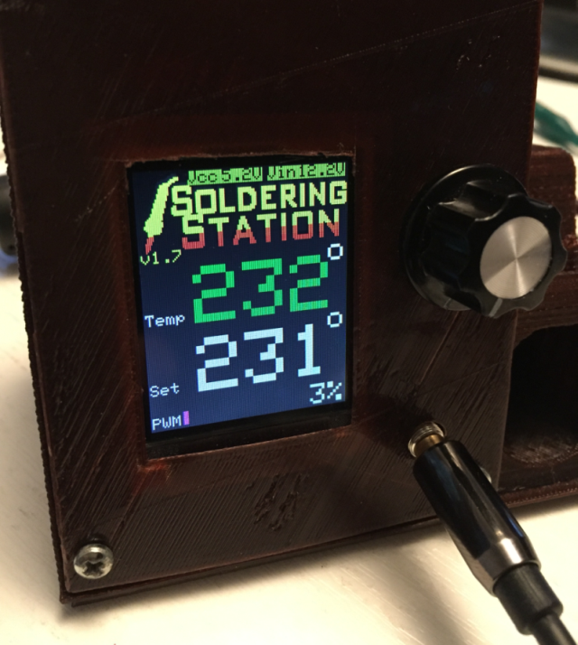
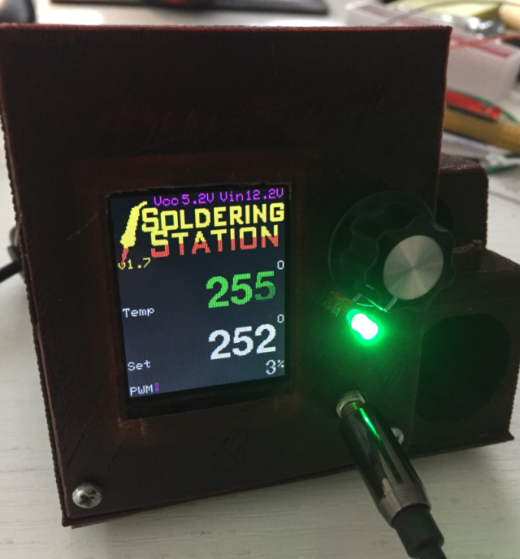
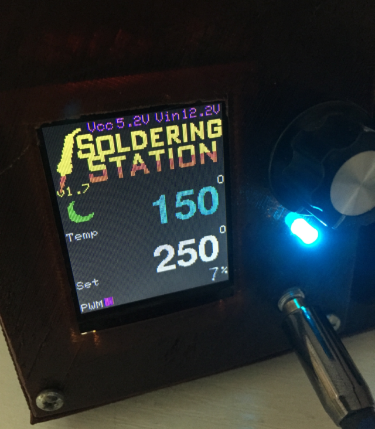
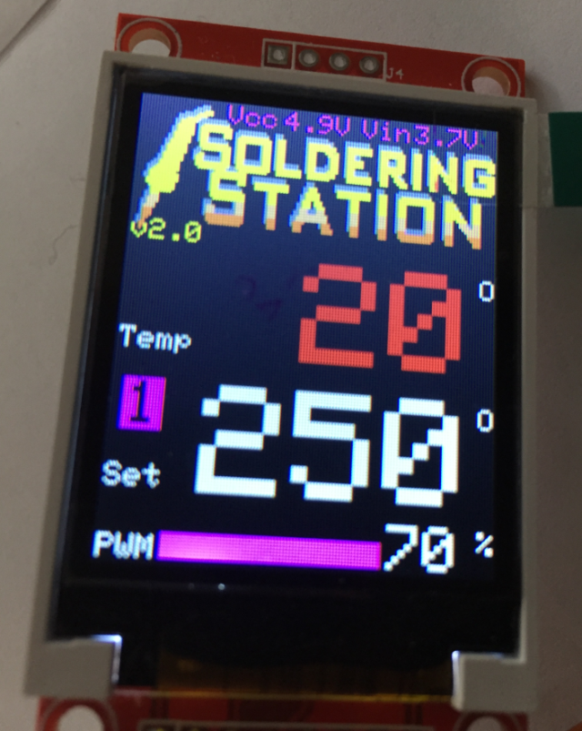

# Solderingstation using Weller RT
Enhanced fork of the weller tip based solderstation from DebuggingLab
based on work from Matthias Wagner
https://debugginglab.wordpress.com/2014/10/30/soldering-station/

Modified by jleg99@gmail.com, including some experimenting with highres fonts and click/rotary encoder (replacing the pot):

* code cleanup
* new shutdown mode (default: 5 minutes)
* fixed optional RGB LED and fume fan support
* measure and show Vcc and Vin (simple voltage divider for Vin needed)
* icons to show standby and shutdown modes
* PWM is visualized using a bar graph
* other splash screen :)
* version 2: support for rotary encoder and temperature presets

## Notes on BOM
* i used "MK-MK146" from reichelt.de as ready-made tip connection; it has a nice flexible wire
* the Weller RT tips are rated for 12V 40W, so a power supply of about 4A is needed
* with the RT1 it takes less than 5 seconds from ambient to 280° - nice! :-)
* i used an encoder module which can easily be found on ebay, search for "rotary encoder module"
* since i wanted to use this station mainly for SMD stuff, i chose the "WELLER RT 1", also from reichelt.de
* the PCB is available here: [http://dirtypcbs.com/store/designer/details/5145/124/soldering-station](http://dirtypcbs.com/store/designer/details/5145/124/soldering-station "DirtyPCBs")
* the original BOM is linked from the original site (s.a.), direct link: [https://github.com/ConnyCola/SolderingStation/blob/master/eagle/BOM_PartsList.txt](https://github.com/ConnyCola/SolderingStation/blob/master/eagle/BOM_PartsList.txt "original BOM")

# 3 versions (branches) available

## V1.7 - standard fonts
* this is more or less the original version with the enhancements/extensions mentioned above

## V1.7 - smooth fonts
* same as above, but using highres fonts from Adafruit TFT lib
* i regard this as an "experiment" :)
* fonts fill up available flash quite heavily
* i wasn't able to eliminate flicker completely

## V2.0 - click encoder with normal fonts
* based on version with regular fonts, i replaced the pot with a standard cheapo click encoder
* a click switches to the next temperature preset
* a long click (hold) stores the current set value to the current preset 

# Hardware mods
I used the original PCB, available from the link above. For the extensions, i soldered some wires to the pro mini socket directly:
## Anti fume fan
* A0 - i used a cheap MOSFET module for Arduino, using a IRF520
## Voltage measurement
* Vcc is measured using the internal reference
* to optionally also measure Vin, i soldered 2 resistors to A6: Vin o---[22k]---oA6o---[5.6k]---o GND
* this should be good for up to 24V Vin
## Click encoder
* i used D15, D16 for pahes A/B (or Data/Clock), and D17 for the button
* for some unknown reason, the original PCB which i used had D16 connected to Vcc, so i scratched a PCB trace
* as an alternative, the now unused Pot pin A5 could also be used to avoid the problem with the trace

# Gallery
Standard fonts

Highres fonts

Station is in standby mode - temp goes down to 150° (after another 5 minutes, temp will go down to 0°)

Using cheap click encoder module, running "preset 1"

